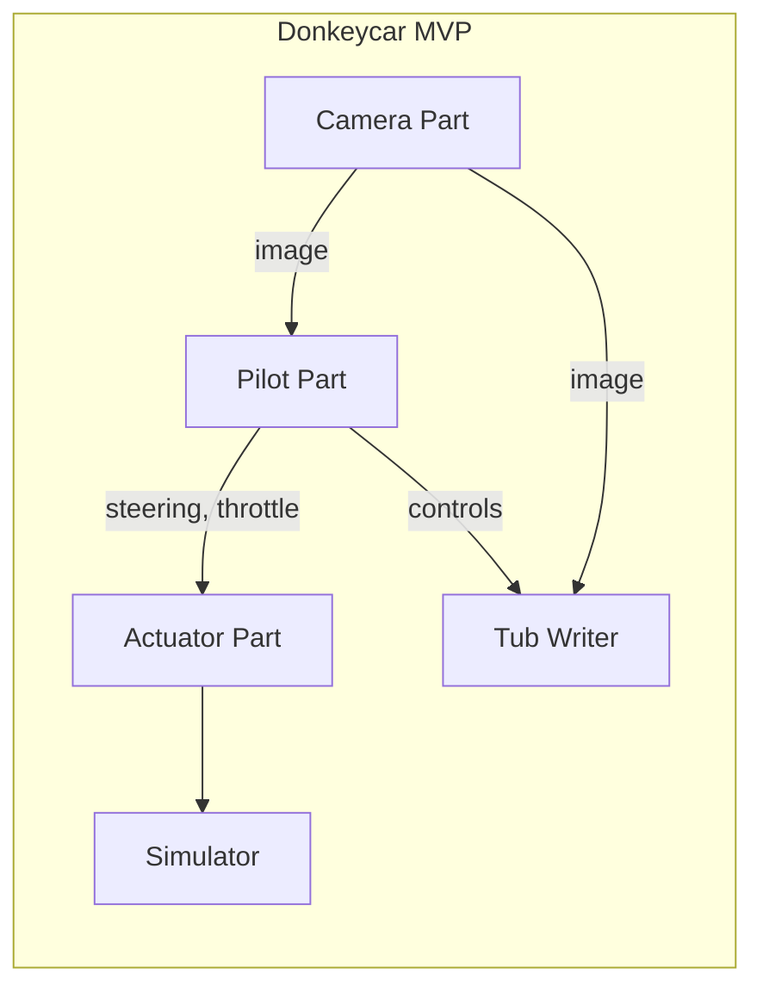

# Donkeycar MVP 코드 흐름

## 아키텍처 개요



## Vehicle Loop (20Hz)

```python
while running:
    # 1. Camera → 이미지 획득
    image = camera.run()
    
    # 2. Pilot → 제어값 예측
    steering, throttle = pilot.run(image)
    
    # 3. Actuator → 명령 전달
    actuator.run(steering, throttle)
    
    # 4. Tub Writer → 데이터 저장
    tub_writer.run(image, steering, throttle)
```

## Parts 구조

| Part | 입력 | 출력 | 역할 |
|------|------|------|------|
| SimCameraPart | - | image | 카메라 이미지 획득 |
| KerasPilot | image | steering, throttle | CNN 기반 제어 예측 |
| ActuatorPart | steering, throttle | - | 차량 제어 |
| TubWriter | image, steering, throttle | - | 데이터 저장 |

## 실행 명령어

```bash
# 수동 운전 + 데이터 수집
python manage.py drive

# 자율주행 모드
python manage.py drive --model models/mypilot.h5

# 학습
donkey train --tub ./data --model models/mypilot.h5
```

## 데이터 흐름

```
[drive 모드]
Simulator → Camera → Pilot → Actuator → Simulator
                ↓
            Tub Writer → data/tub_xxx/

[train 모드]
data/tub_xxx/ → TubReader → Model.fit() → models/mypilot.h5
```

## 참고

- Donkeycar: https://docs.donkeycar.com
- gym-donkeycar: https://github.com/tawnkramer/gym-donkeycar
- PilotNet (Bojarski et al., 2016)
